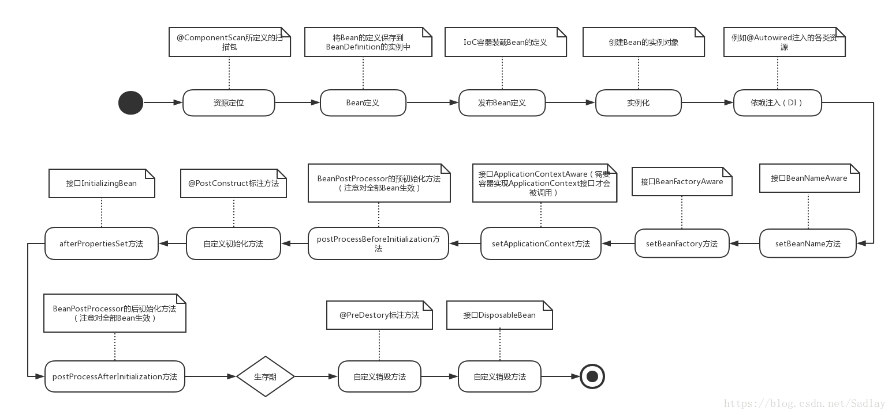

# Spring
Spring是一个轻量级控制反转(IoC)和面向切面(AOP)的容器框架。
## Spring初衷
* JAVA EE开发应该更加简单。
* 使用接口而不是使用类，是更好的编程习惯。Spring将使用接口的复杂度几乎降低到了零。
* 为JavaBean提供了一个更好的应用配置框架。
* 更多地强调面向对象的设计，而不是现行的技术如JAVA EE。
* 尽量减少不必要的异常捕捉。
* 使应用程序更加容易测试。

## Spring的目标
* 可以令人方便愉快的使用Spring
* 应用程序代码并不依赖于Spring APIS
* Spring不和现有的解决方案竞争，而是致力于将它们融合在一起

## 基本组成
* 最完善的轻量级核心框架。
* 通用的事务管理抽象层。
* JDBC抽象层。
* AOP功能。
* IOC功能
* 灵活的MVC Web应用框架。

## IOC

### 思维导图


### 描述
* 控制反转模式（也称作依赖性介入）的基本概念是：不创建对象，但是描述创建它们的方式。在代码中不直接与对象和服务连接，但在配置文件中描述哪一个组件需要哪一项服务。容器 （在 Spring 框架中是 IOC 容器） 负责将这些联系在一起。
* 在典型的 IOC 场景中，容器创建了所有对象，并设置必要的属性将它们连接在一起，决定什么时间调用方法。下表列出了 IOC 的一个实现模式。
### 基本功能
* 通过描述管理Bean，包括发布和获取Bean
* 通过描述完成Bean之间的依赖关系
### 部分源码解析
Spring 设计的核心是 org.springframework.beans 包，
它的设计目标是与 JavaBean 组件一起使用。
这个包通常不是由用户直接使用，
而是由服务器将其用作其他多数功能的底层中介。
下一个最高级抽象是 BeanFactory 接口，
它是工厂设计模式的实现，允许通过名称创建和检索对象。
BeanFactory 也可以管理对象之间的关系。
#### BeanFactory 
* BeanFactory支持两个对象模型
    * **单态**
        模型提供了具有特定名称的对象的共享实例，可以在查询时对其进行检索。Singleton 是默认的也是最常用的对象模型。对于无状态服务对象很理想。
    * **原型**
        模型确保每次检索都会创建单独的对象。在每个用户都需要自己的对象时，原型模型最适合。
* 源码
```
public interface BeanFactory {
	//前缀
	String FACTORY_BEAN_PREFIX = "&";

	//多个getBean方法获取Bean
	Object getBean(String name) throws BeansException;

	<T> T getBean(String name, @Nullable Class<T> requiredType) throws BeansException;

	Object getBean(String name, Object... args) throws BeansException;

	<T> T getBean(Class<T> requiredType) throws BeansException;

	<T> T getBean(Class<T> requiredType, Object... args) throws BeansException;

	//是否包含Bean
	boolean containsBean(String name);
    
	//Bean是否单例
	boolean isSingleton(String name) throws NoSuchBeanDefinitionException;
    
	//Bean是否原型
	boolean isPrototype(String name) throws NoSuchBeanDefinitionException;

	//是否类型匹配
	boolean isTypeMatch(String name, ResolvableType typeToMatch) throws NoSuchBeanDefinitionException;

	boolean isTypeMatch(String name, @Nullable Class<?> typeToMatch) throws NoSuchBeanDefinitionException;

	//获取Bean的类型
	Class<?> getType(String name) throws NoSuchBeanDefinitionException;

	//获取Bean的别名
	String[] getAliases(String name);
```            
    
#### ApplicationContext
由于BeanFactory的功能不够强大，因此Spring在BeanFactory的基础上，设计了一个更为高级的接口ApplicationContext，它是BeanFactory的子接口之一，在Spring的体系中，BeanFactory和ApplicationContext是最为重要的接口设计，在现实中我们使用的大部分Spring IoC容器是ApplicationContext接口的实现类。


#### bean生命周期


* 初始化示意图


* 初始化步骤说明
    * spring通过我们的配置，如@ComponentScan定义的扫描路径去找到带有@Component的类，这个过程就是一个资源定位的过程
    * 一旦找到资源，那么它就开始解析，并将定义的信息保存起来，注意，此时还没有初始化bean，也就没有bean的实例，它有的仅仅是bean的定义。
    * 然后就会把bean定义发布到Spring IoC容器中。此时，IoC容器也只有bean的定义，还是没有bean的实例生成。
    
* 生命周期示意图


* 完整版




    

        


## AOP


