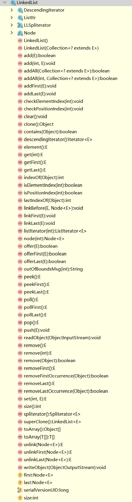

# LinkedList

## 底层

`LinkedList`底层采用链表`Node`实现数据存储
每一个node记录上一个节点和下一个节点,本身记录第一个节点和最后一个节点

## 方法



* 内部方法
    * `node`,获取index对应的node节点
    ```
    Node<E> node(int index) {
        // assert isElementIndex(index);
        if (index < (size >> 1)) {
            Node<E> x = first;
            for (int i = 0; i < index; i++)
                x = x.next;
            return x;
        } else {
            Node<E> x = last;
            for (int i = size - 1; i > index; i--)
                x = x.prev;
            return x;
        }
    }
    ```
    从源码可得,根据index与size>>1的判断,从first或者last出发寻找对应节点
    
    * `linkBefore`,在指定节点之前插入数据
    ```
    public void add(int index, E element) {
        checkPositionIndex(index);
        if (index == size)
            linkLast(element);
        else
            linkBefore(element, node(index));
    }
    
    void linkBefore(E e, Node<E> succ) {
        // assert succ != null;
        final Node<E> pred = succ.prev;
        final Node<E> newNode = new Node<>(pred, e, succ);
        succ.prev = newNode;
        if (pred == null)
            first = newNode;
        else
            pred.next = newNode;
        size++;
        modCount++;
    }
    ```
    从源码可得,会直接修改Node数据,将`e`插入链表中(当前数据的上一个节点的next改为e,下一个节点的prev改为e)
    
    
    