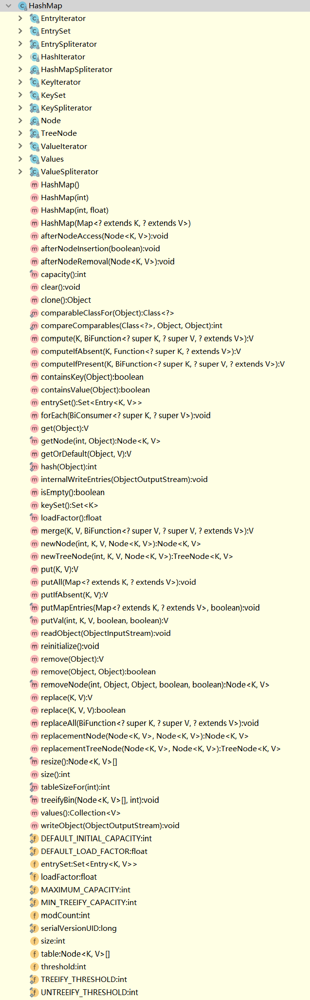

# HashMap

## 底层

底层使用`数组`与`链表`实现,首先通过hashcode求模的方式获得`数组`下标,然后进行链表(元素大于1时)处理

## 方法



## 变量解释

名称|说明
---|---
size|size表示HashMap中存放KV的数量（为链表和树中的KV的总和）。
capacity|capacity译为容量。capacity就是指HashMap中桶的数量。默认值为16。一般第一次扩容时会扩容到64，之后好像是2倍。总之，容量都是2的幂。
loadFactor|loadFactor译为装载因子。装载因子用来衡量HashMap满的程度。loadFactor的默认值为0.75f。计算HashMap的实时装载因子的方法为：size/capacity，而不是占用桶的数量去除以capacity。
threshold|`threshold=capacity*loadFactor`,过大时,直接为`Integer.MAX_VALUE`,threshold表示当HashMap的size大于threshold时会执行resize操作。 


## hash实现方式
```
  static final int hash(Object key) {
        int h;
        return (key == null) ? 0 : (h = key.hashCode()) ^ (h >>> 16);
    }
```
假定hashCode为1

表达式|二进制|十进制
---|---|---
1      |  0000 0001 |1
1>>>16 |  0000 0000 |0
1^(1>>>16)|0000 0001|1

`>>>`见[位移运算符](../../运算符.md#位移运算符)
`^`见[逻辑运算符](../../运算符.md#逻辑运算符)

## resize
```
final Node<K,V>[] resize() {
        Node<K,V>[] oldTab = table;
        int oldCap = (oldTab == null) ? 0 : oldTab.length;
        int oldThr = threshold;
        int newCap, newThr = 0;
        if (oldCap > 0) {
            if (oldCap >= MAXIMUM_CAPACITY) {
                threshold = Integer.MAX_VALUE;
                return oldTab;
            }
            else if ((newCap = oldCap << 1) < MAXIMUM_CAPACITY &&
                     oldCap >= DEFAULT_INITIAL_CAPACITY)
                newThr = oldThr << 1; // double threshold
        }
        else if (oldThr > 0) // initial capacity was placed in threshold
            newCap = oldThr;
        else {               // zero initial threshold signifies using defaults
            newCap = DEFAULT_INITIAL_CAPACITY;
            newThr = (int)(DEFAULT_LOAD_FACTOR * DEFAULT_INITIAL_CAPACITY);
        }
        if (newThr == 0) {
            float ft = (float)newCap * loadFactor;
            newThr = (newCap < MAXIMUM_CAPACITY && ft < (float)MAXIMUM_CAPACITY ?
                      (int)ft : Integer.MAX_VALUE);
        }
        threshold = newThr;
        @SuppressWarnings({"rawtypes","unchecked"})
            Node<K,V>[] newTab = (Node<K,V>[])new Node[newCap];
        table = newTab;
        if (oldTab != null) {
            for (int j = 0; j < oldCap; ++j) {
                Node<K,V> e;
                if ((e = oldTab[j]) != null) {
                    oldTab[j] = null;
                    if (e.next == null)
                        newTab[e.hash & (newCap - 1)] = e;
                    else if (e instanceof TreeNode)
                        ((TreeNode<K,V>)e).split(this, newTab, j, oldCap);
                    else { // preserve order
                        Node<K,V> loHead = null, loTail = null;
                        Node<K,V> hiHead = null, hiTail = null;
                        Node<K,V> next;
                        do {
                            next = e.next;
                            if ((e.hash & oldCap) == 0) {
                                if (loTail == null)
                                    loHead = e;
                                else
                                    loTail.next = e;
                                loTail = e;
                            }
                            else {
                                if (hiTail == null)
                                    hiHead = e;
                                else
                                    hiTail.next = e;
                                hiTail = e;
                            }
                        } while ((e = next) != null);
                        if (loTail != null) {
                            loTail.next = null;
                            newTab[j] = loHead;
                        }
                        if (hiTail != null) {
                            hiTail.next = null;
                            newTab[j + oldCap] = hiHead;
                        }
                    }
                }
            }
        }
        return newTab;
    }
    
```
分析源码可知,假定hashmap需要扩容,则会将`capacity`,`threshold`均进行`<<1`运算,即`*2`,
每次扩容会将数组大小翻倍,然后每个节点进行下表进行计算,放入新的位置

## putVal
```
final V putVal(int hash, K key, V value, boolean onlyIfAbsent,
                   boolean evict) {
        Node<K,V>[] tab; Node<K,V> p; int n, i;
        if ((tab = table) == null || (n = tab.length) == 0)
            n = (tab = resize()).length;
        if ((p = tab[i = (n - 1) & hash]) == null)
            tab[i] = newNode(hash, key, value, null);
        else {
            Node<K,V> e; K k;
            if (p.hash == hash &&
                ((k = p.key) == key || (key != null && key.equals(k))))
                e = p;
            else if (p instanceof TreeNode)
                e = ((TreeNode<K,V>)p).putTreeVal(this, tab, hash, key, value);
            else {
                for (int binCount = 0; ; ++binCount) {
                    if ((e = p.next) == null) {
                        p.next = newNode(hash, key, value, null);
                        if (binCount >= TREEIFY_THRESHOLD - 1) // -1 for 1st
                            treeifyBin(tab, hash);
                        break;
                    }
                    if (e.hash == hash &&
                        ((k = e.key) == key || (key != null && key.equals(k))))
                        break;
                    p = e;
                }
            }
            if (e != null) { // existing mapping for key
                V oldValue = e.value;
                if (!onlyIfAbsent || oldValue == null)
                    e.value = value;
                afterNodeAccess(e);
                return oldValue;
            }
        }
        ++modCount;
        if (++size > threshold)
            resize();
        afterNodeInsertion(evict);
        return null;
    }
```
查看原码可知,数组下标的计算方法为
`i = (n - 1) & hash`,其中`n`为内部数组长度,hash为之前hash计算得出,进行`&`运算后得到数组下标,
如果元素为空,则将该`value`构建一个node放入数组该位置,
如果不为空,则遍历链表,根据key的hash和eq判断,进行替换操作,
如果到最后一个节点`p.next==null`仍然没有结束遍历,则追加新节点

### 数组下标计算说明

```
    public HashMap(int initialCapacity, float loadFactor) {
        if (initialCapacity < 0)
            throw new IllegalArgumentException("Illegal initial capacity: " +
                                               initialCapacity);
        if (initialCapacity > MAXIMUM_CAPACITY)
            initialCapacity = MAXIMUM_CAPACITY;
        if (loadFactor <= 0 || Float.isNaN(loadFactor))
            throw new IllegalArgumentException("Illegal load factor: " +
                                               loadFactor);
        this.loadFactor = loadFactor;
        this.threshold = tableSizeFor(initialCapacity);
    }
    
    static final int tableSizeFor(int cap) {
        int n = cap - 1;
        n |= n >>> 1;
        n |= n >>> 2;
        n |= n >>> 4;
        n |= n >>> 8;
        n |= n >>> 16;
        return (n < 0) ? 1 : (n >= MAXIMUM_CAPACITY) ? MAXIMUM_CAPACITY : n + 1;
    }
```

实际通过位运算取代求模运算,
由于内部在初始化的时候,
将`threshold`,进行`tableSizeFor`处理,
保证了每次数组长度均为2的幂次方,
假定数组长度为2,hashcode为4,
计算hash为`4^(4>>>16)`为4,
数组下标为 `(2 - 1) & 4`

`>>>`见[位移运算符](../../运算符.md#位移运算符)
`&`见[逻辑运算符](../../运算符.md#逻辑运算符)

表达式|二进制|十进制
---|---|---
4           |0000 0110| 4
4>>>16      |0000 0000| 0
4^(4>>>16)  |0000 0110| 4
2-1         |0000 0001| 1
(2-1) & 4    |0000 0000| 0 

假定数组长度为2,hashcode为3,
计算hash为`3^(3>>>16)`为3,
数组下标为 `(2 - 1) & 3`

表达式|二进制|十进制
---|---|---
3           |0000 0011| 3
3>>>16      |0000 0000| 0
3^(3>>>16)  |0000 0011| 3
2-1         |0000 0001| 1
(2-1) & 3   |0000 0001| 1 


