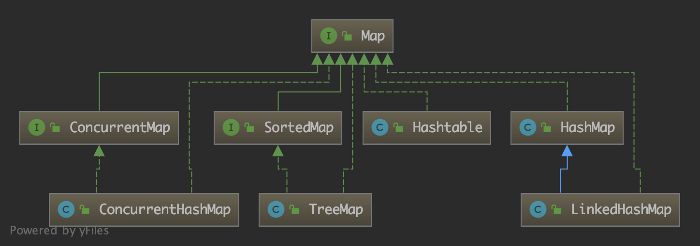

# Map
Map 是一个接口，它表示一种“键-值（key-value）”映射的对象（Entry），其中键是不重复的（值可以重复），且最多映射到一个值（可以理解为“映射”或者“字典”）

## 关系图

Map 常用的实现类有 HashMap、TreeMap、ConcurrentHashMap、LinkedHashMap 等，它们的继承结构如下：

## [HashMap](HashMap.md)

## [TreeMap](TreeMap.md)

## [ConcurrentHashMap](ConcurrentHashMap.md)

## [LinkedHashMap](LinkedHashMap.md)
