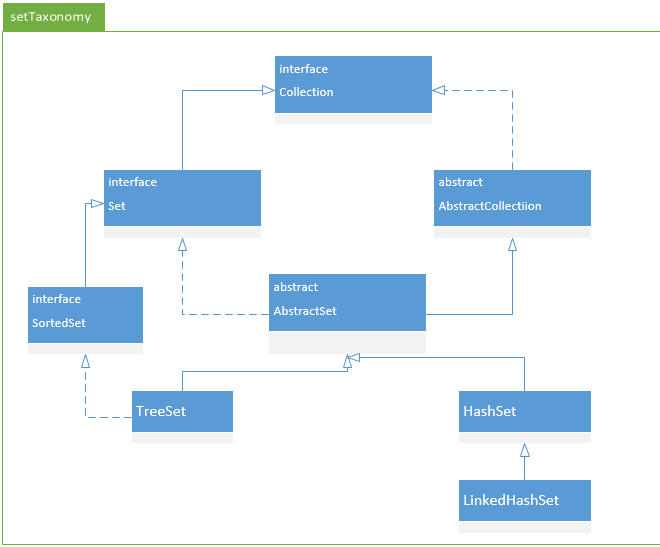

# Set

## Set整体结构

Set接口继承了Collection接口。特点是不保存重复的元素。

## [AbstractSet](AbstractSet.md)

是一个抽象类，它继承于AbstractCollection，实现了Set。AbstractCollection提供了Set接口的骨干实现，从而最大限度地减少了实现此接口所需的工作。

## [SortedSet](SortedSet.md)

进一步提供关于元素的总体排序的Set。这些元素使用其自然顺序进行排序，或者根据通常在创建有序set时提供的Comparator进行排序。该set的迭代器将按元素升序遍历set。提供了一些附加的操作来利用这种排序。

## [NavigableSet](NavigableSet.md)

扩展的SortedSet，具有了为给定搜索目标报告最接近匹配项的导航方法。

## [HashSet](HashSet.md)

依赖于哈希表的实现，实际上是个[HashMap](../map/HashMap.md)的实例。它不保证set的迭代顺序；特别是它不保证该顺序恒久不变。此类允许使用null 元素。

## [TreeSet](TreeSet.md)

基于TreeMap的NavigableSet实现。使用元素的自然顺序对元素进行排序，或者根据创建set时提供的Comparator进行排序，具体取决于使用的构造方法。

## [LinkedHashSet](LinkedHashSet.md)

具有可预知迭代顺序的Set接口的哈希表和链接列表实现。继承HashSet ，具有HashSet的查询速度，维护着一个运行于所有条目的双重链接列表。此链接列表定义了迭代顺序，即按照将元素插入到set中的顺序（插入顺序）进行迭代。注意，插入顺序不受在 set 中重新插入的元素的影响。元素插入的次序显示。