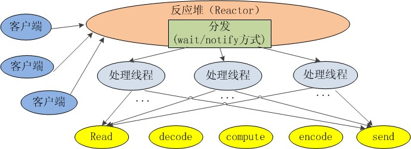
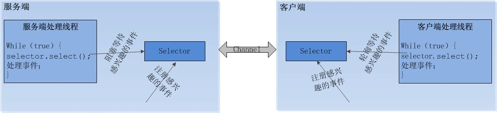

# NIO
JDK 1.4中的java.nio.*包中引入新的Java I/O库，其目的是提高速度。实际上，**"旧"的I/O包已经使用NIO重新实现过，即使我们不显式的使用NIO编程，也能从中受益。**

## 原理

1. 由一个专门的线程来处理所有的 IO 事件，并负责分发。
2. 事件驱动机制：事件到的时候触发，而不是同步的去监视事件。 
3. 线程通讯：线程之间通过 wait,notify 等方式通讯。保证每次上下文切换都是有意义的。减少无谓的线程切换。 


（注：每个线程的处理流程大概都是读取数据、解码、计算处理、编码、发送响应。）

* Java NIO的服务端只需启动一个专门的线程来处理所有的 IO 事件，这种通信模型是怎么实现的呢？呵呵，我们一起来探究它的奥秘吧。java NIO采用了双向通道（channel）进行数据传输，而不是单向的流（stream），在通道上可以注册我们感兴趣的事件。
一共有以下四种事件：

    事件名	|对应值
    ---|---
    服务端接收客户端连接事件	|SelectionKey.OP_ACCEPT(16)
    客户端连接服务端事件	|SelectionKey.OP_CONNECT(8)
    读事件	|SelectionKey.OP_READ(1)
    写事件	|SelectionKey.OP_WRITE(4)
服务端和客户端各自维护一个管理通道的对象，我们称之为selector，
该对象能检测一个或多个通道 (channel) 上的事件。
我们以服务端为例，如果服务端的selector上注册了读事件，
某时刻客户端给服务端发送了一些数据，
阻塞I/O这时会调用read()方法阻塞地读取数据，
而NIO的服务端会在selector中添加一个读事件。
服务端的处理线程会轮询地访问selector，
如果访问selector时发现有感兴趣的事件到达，
则处理这些事件，如果没有感兴趣的事件到达，
则处理线程会一直阻塞直到感兴趣的事件到达为止。
下面是我理解的java NIO的通信模型示意图：




### IO和NIO的区别

IO是面向流`Stream`的处理，NIO是面向块(缓冲区)`Buffer`的处理,NIO非阻塞,需要Selectors协助
* 面向流的I/O,系统一次一个字节地处理数据
* 面向块(缓冲区)的I/O系统以块的形式处理数据。

### NIO核心

* Buffer缓冲区
* Channel管道
* Selector选择器

在NIO中并不是以流的方式来处理数据的，而是以buffer缓冲区和Channel管道配合使用来处理数据。
**Channel管道比作成铁路，buffer缓冲区比作成火车(运载着货物)**
NIO就是通过Channel管道运输着存储数据的Buffer缓冲区的来实现数据的处理！
* Channel只运输数据
* Buffer才是数据

### 简单java实现
服务端
```
package nio;

import java.io.IOException;
import java.net.InetSocketAddress;
import java.nio.ByteBuffer;
import java.nio.channels.SelectionKey;
import java.nio.channels.Selector;
import java.nio.channels.ServerSocketChannel;
import java.nio.channels.SocketChannel;
import java.util.Iterator;

public class NIOServer {
    //多路复用器
    private Selector selector;

    /**
     * 获得一个ServerSocket通道，并对该通道做一些初始化的工作
     *
     * @param port 绑定的端口号
     * @throws IOException
     */
    public void initServer(int port) throws IOException {
        // 获得一个ServerSocket通道
        ServerSocketChannel serverChannel = ServerSocketChannel.open();
        // 设置通道为非阻塞
        serverChannel.configureBlocking(false);
        // 将该通道对应的ServerSocket绑定到port端口
        serverChannel.socket().bind(new InetSocketAddress(port));
        // 获得一个通道管理器
        this.selector = Selector.open();
        //将通道管理器和该通道绑定，并为该通道注册SelectionKey.OP_ACCEPT事件,注册该事件后，
        //当该事件到达时，selector.select()会返回，如果该事件没到达selector.select()会一直阻塞。
        serverChannel.register(selector, SelectionKey.OP_ACCEPT);
    }


    /**
     * 采用轮询的方式监听selector上是否有需要处理的事件，如果有，则进行处理
     *
     * @throws IOException
     */
    public void listen() throws IOException {
        System.out.println("服务端启动成功！");
        // 轮询访问selector
        while (true) {
            //当注册的事件到达时，方法返回；否则,该方法会一直阻塞
            selector.select();
            // 获得selector中选中的项的迭代器，选中的项为注册的事件
            Iterator ite = this.selector.selectedKeys().iterator();
            while (ite.hasNext()) {
                SelectionKey key = (SelectionKey) ite.next();
                // 删除已选的key,以防重复处理
                ite.remove();
                // 客户端请求连接事件
                if (key.isAcceptable()) {
                    ServerSocketChannel server = (ServerSocketChannel) key
                            .channel();
                    // 获得和客户端连接的通道
                    SocketChannel channel = server.accept();
                    // 设置成非阻塞
                    channel.configureBlocking(false);
                    //在这里可以给客户端发送信息哦
                    channel.write(ByteBuffer.wrap(new String("向客户端发送了一条信息").getBytes()));
                    //在和客户端连接成功之后，为了可以接收到客户端的信息，需要给通道设置读的权限。
                    channel.register(this.selector, SelectionKey.OP_READ);

                    // 获得了可读的事件
                } else if (key.isReadable()) {
                    read(key);
                }
            }
        }
    }

    /**
     * 处理读取客户端发来的信息 的事件
     *
     * @param key
     * @throws IOException
     */
    public void read(SelectionKey key) throws IOException {
        // 服务器可读取消息:得到事件发生的Socket通道
        SocketChannel channel = (SocketChannel) key.channel();
        // 创建读取的缓冲区
        ByteBuffer buffer = ByteBuffer.allocate(1000);
        channel.read(buffer);
        byte[] data = buffer.array();
        String msg = new String(data).trim();
        System.out.println("服务端收到信息：" + msg);
        ByteBuffer outBuffer = ByteBuffer.wrap(msg.getBytes("utf-8"));
        channel.write(outBuffer);// 将消息回送给客户端
    }

    /**
     * 启动服务端测试
     *
     * @throws IOException
     */
    public static void main(String[] args) throws IOException {
        NIOServer server = new NIOServer();
        //初始化
        server.initServer(8001);
        //开始监听
        server.listen();
    }
}

```

客户端
```
package nio;

import java.io.IOException;
import java.net.InetSocketAddress;
import java.nio.ByteBuffer;
import java.nio.channels.SelectionKey;
import java.nio.channels.Selector;
import java.nio.channels.SocketChannel;
import java.util.Iterator;

public class NIOClient {
    //通道管理器
    private Selector selector;

    /**
     * 获得一个Socket通道，并对该通道做一些初始化的工作
     *
     * @param ip   连接的服务器的ip
     * @param port 连接的服务器的端口号
     * @throws IOException
     */
    public void initClient(String ip, int port) throws IOException {
        // 获得一个Socket通道
        SocketChannel channel = SocketChannel.open();
        // 设置通道为非阻塞
        channel.configureBlocking(false);
        // 获得一个通道管理器
        this.selector = Selector.open();

        // 客户端连接服务器,其实方法执行并没有实现连接，需要在listen（）方法中调
        //用channel.finishConnect();才能完成连接
        channel.connect(new InetSocketAddress(ip, port));
        //将通道管理器和该通道绑定，并为该通道注册SelectionKey.OP_CONNECT事件。
        channel.register(selector, SelectionKey.OP_CONNECT);
    }

    /**
     * 采用轮询的方式监听selector上是否有需要处理的事件，如果有，则进行处理
     *
     * @throws IOException
     */
    public void listen() throws IOException {
        // 轮询访问selector
        while (true) {
            selector.select();
            // 获得selector中选中的项的迭代器
            Iterator ite = this.selector.selectedKeys().iterator();
            while (ite.hasNext()) {
                SelectionKey key = (SelectionKey) ite.next();
                // 删除已选的key,以防重复处理
                ite.remove();
                // 连接事件发生
                if (key.isConnectable()) {
                    SocketChannel channel = (SocketChannel) key
                            .channel();
                    // 如果正在连接，则完成连接
                    if (channel.isConnectionPending()) {
                        channel.finishConnect();
                    }
                    // 设置成非阻塞
                    channel.configureBlocking(false);
                    //在这里可以给服务端发送信息哦
                    channel.write(ByteBuffer.wrap("向服务端发送了一条信息".getBytes("utf-8")));
                    //在和服务端连接成功之后，为了可以接收到服务端的信息，需要给通道设置读的权限。
                    channel.register(this.selector, SelectionKey.OP_READ);
                    // 获得了可读的事件
                } else if (key.isReadable()) {
                    read(key);
                }

            }

        }
    }

    /**
     * 处理读取服务端发来的信息 的事件
     *
     * @param key
     * @throws IOException
     */
    public void read(SelectionKey key) throws IOException {
        //和服务端的read方法一样
    }


    /**
     * 启动客户端测试
     *
     * @throws IOException
     */
    public static void main(String[] args) throws IOException {
        NIOClient client = new NIOClient();
        client.initClient("localhost", 8001);
        client.listen();
    }

}

```


