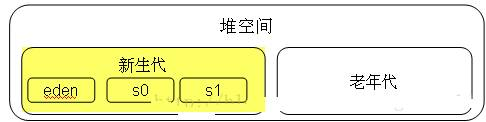
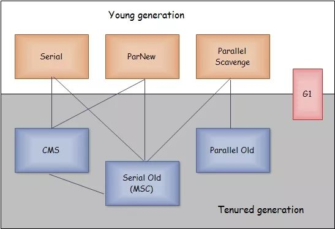

# 垃圾回收
    java为了降低开发门槛,提升开发效率,将内存回收交给jvm自行处理
_______________
## 内存回收算法
多种内存回收的方式

### 引用计数法
* 在对象头处维护一个counter，每增加一次对该对象的引用计数器自加，如果对该对象的引用失联，则计数器自减。当counter为0时，表明该对象已经被废弃，不处于存活状态。这种方式一方面无法区分软、虛、弱、强引用类别。另一方面，会造成死锁，假设两个对象相互引用始终无法释放counter，永远不能GC。
### 可达性分析算法
* 通过一系列为GC Roots的对象作为起始点，从这些节点开始向下搜索，搜索所走过的路径称为引用链，当一个对象到GC Roots没有任何引用链相连时，则证明该对象是不可用的。如果对象在进行可行性分析后发现没有与GC Roots相连的引用链，也不会理解死亡。它会暂时被标记上并且进行一次筛选，筛选的条件是是否与必要执行finalize()方法。如果被判定有必要执行finaliza()方法，就会进入F-Queue队列中，并有一个虚拟机自动建立的、低优先级的线程去执行它。稍后GC将对F-Queue中的对象进行第二次小规模标记。如果这时还是没有新的关联出现，那基本上就真的被回收了。
* 可达性分析算法是通过枚举根节点来实现的，最重要的问题是`GC停顿`
* `GC停顿`为了确保一致性(即所有对象之间的关系是确定下来的)而导致GC进行时必须进行停顿。在HotSpot的中，使用OopMap的数据结构存储特定位置上的调试信息，存储栈上那个位置原来是什么东西，这个信息是在JIT编译时跟机器码一起产生的。因为只有编译器知道源代码跟产生的代码的对应关系。 这样，GC在扫描时就可以得知这些信息了。这样做的目的是使HotSpot能够快速准确的完成GC Roots枚举，以期望减少GC停顿所带来的影响。HotSpot没有在所有的指令生成OopMap，所以只是在“特定位置”记录这些信息，这些位置就是安全点。程序执行时并非在所有的位置上都能停顿下来GC，只有在到达安全点时才能暂停。安全点选取基本上是以“是否让程序长时间执行的特征”选定。此外，HotSpot虚拟机在安全点的基础上还增加了安全区域的概念，安全区域是安全点的扩展。在一段安全区域中能够实现安全点不能达成的效果。

### 标记-清除算法
* 首先标记出所有需要回收的对象，在标记完成后统一回收掉所有被标记的对象。之所以说它是最基础的收集算法，是因为后续的收集算法都是基于这种思路并对其缺点进行改进而得到的。
* 缺点
    * 效率问题：标记和清除过程的效率都不高
    * 空间问题：标记清除之后会产生大量不连续的内存碎片，空间碎片太多可能会导致，碎片过多会导致大对象无法分配到足够的连续内存，从而不得不提前触发GC，甚至Stop The World

### 复制算法
* 它将可用内存按容量划分为大小相等的两块，每次只使用其中的一块。当这一块的内存用完了，就将还存活着的对象复制到另外一块上面，然后再把已使用过的内存空间一次清理掉。
这样使得每次都是对其中的一块进行内存回收，内存分配时也就不用考虑内存碎片等复杂情况，只要移动堆顶指针，按顺序分配内存即可，实现简单，运行高效。
* 缺点
    * 效率问题：在对象存活率较高时，复制操作次数多，效率降低
    * 空间问题：內存缩小了一半；需要額外空间做分配担保(老年代)
* `From Survivor, To Survivor`
    * 将内存分为一块较大的Eden空间和两块较小的Survivor空间，每次使用Eden和其中一块Survivor。 
    当进行垃圾回收时，将Eden和Survivor中还存活的对象一次性地复制到另外一块Survivor空间上，
    最后处理掉Eden和刚才的Survivor空间。（HotSpot虚拟机默认Eden和Survivor的大小比例是8:1）当Survivor空间不够用时，需要依赖老年代进行分配担保。
    
### 标记-整理算法
* 标记过程仍然与“标记-清除”算法一样，但后续步骤不是直接对可回收对象进行清理，而是让所有存活的对象都向一端移动，然后直接清理掉端边界以外的内存。
_________

## 内存分代与算法选择

根据对象引用周期不同,将对象分布在不同的内存空间中

### 新生代
* 新生代的目标就是尽可能快速的收集掉那些生命周期短的对象，一般情况下，所有新生成的对象首先都是放在新生代的. 如果老年代也满了，就会触发一次FullGC，也就是新生代、老年代都进行回收。注意，新生代发生的GC也叫做MinorGC，MinorGC发生频率比较高，不一定等 Eden区满了才触发。
### 老年代
* 老年代存放的都是一些生命周期较长的对象，就像上面所叙述的那样，在新生代中经历了N次垃圾回收后仍然存活的对象就会被放到老年代中
### 永久代
* 永久代主要用于存放静态文件，如Java类、方法等

### 为什么分代收集
* GC分代的基本假设：绝大部分对象的生命周期都非常短暂，存活时间短。
* 不同的对象的生命周期(存活情况)是不一样的，而不同生命周期的对象位于堆中不同的区域，因此对堆内存不同区域采用不同的策略进行回收可以提高 JVM 的执行效率.
* 把Java堆分为新生代和老年代，这样就可以根据各个年代的特点采用最适当的收集算法。在新生代中，每次垃圾收集时都发现有大批对象死去，只有少量存活，那就选用复制算法，只需要付出少量存活对象的复制成本就可以完成收集。
而老年代中因为对象存活率高、没有额外空间对它进行分配担保，就必须使用“标记-清理”或“标记-整理”算法来进行回收。

### 新生代进入老生代的情况
* 对象优先在Eden分配，当Eden区没有足够空间进行分配时，虚拟机将发起一次MinorGC。现在的商业虚拟机一般都采用复制算法来回收新生代，
将内存分为一块较大的Eden空间和两块较小的Survivor空间，每次使用Eden和其中一块Survivor。 
当进行垃圾回收时，将Eden和Survivor中还存活的对象一次性地复制到另外一块Survivor空间上，
最后处理掉Eden和刚才的Survivor空间。
（HotSpot虚拟机默认Eden和Survivor的大小比例是8:1）
**当Survivor空间不够用时，需要依赖老年代进行[分配担保](./#内存分配担保机制)。**
* **大对象直接进入老年代**,大对象指的是需要`大量`且`连续`的内存空间的对象,例如超长字符串与数组
* **长期存活的对象(配置参数:`-XX:MaxTenuringThreshold`)**,指多次minor GC后依然存活的对象,当对象在新生代中经历过一定次数（默认为15）的Minor GC后，就会被晋升到老年代中。
* 动态对象年龄判定。为了更好地适应不同程序的内存状况，
虚拟机并不是永远地要求对象年龄必须达到了MaxTenuringThreshold才能晋升老年代，
如果在Survivor空间中相同年龄所有对象大小的总和大于Survivor空间的一半，
年龄大于或等于该年龄的对象就可以直接进入老年代，无须等到MaxTenuringThreshold中要求的年龄。

### 内存分配担保机制
* 如果对象在复制到Survivor区时若Survivor空间不足，则会出发担保机制，将对象转入老年代；但老年代的能力也不是无限的，
    因此需要在minor GC时做一个是否需要Major GC 的判断：
    * 如果老年代的`剩余空间` < 之前转入老年代的对象的`平均大小`，则触发Major GC
    * 如果老年代的`剩余空间` > 之前转入老年代的对象的`平均大小`，并且`允许担保失败`，则直接Minor GC，不需要做Full GC
    * 如果老年代的`剩余空间` > 之前转入老年代的对象的`平均大小`，并且`不允许担保失败`，则触发Major GC
    **出发点还是尽量为对象分配内存。但是一般会配置允许担保失败，避免频繁的去做Full GC。**
 

### 垃圾收集器

jvm内部使用的垃圾回收程序

#### Serial收集器
* [复制算法](#复制算法)
* 新生代
* 单线程
* 简单高效
#### Serial Old收集器
* [标记-整理算法](#标记-整理算法)
* 单线程
* 老年代
#### ParNew收集器
* [复制算法](#复制算法)
* 多线程
#### Parallel Scavenge收集器
* [复制算法](#复制算法)
* 多线程
* 高吞吐量
    * `吞吐量 =用户线程时间/(用户线程时间+GC线程时间)`，高吞吐量可以高效率的利用CPU时间，尽快完成程序的运算任务，
    * 适合后台应用等`对交互相应要求不高`的场景；
#### Parallel Old收集器
* [标记-整理算法](#标记-整理算法)
* 多线程
* 高吞吐量
#### CMS(Concurrent Mark Sweep)收集器
* [标记-清除算法](#标记-清除算法)
* 多线程
* 高并发、低停顿,`追求最短GC回收停顿时间`
#### G1(Garbage First)收集器
* [标记-整理算法](#标记-整理算法)
* 多线程
* G1回收的范围是整个Java堆(包括新生代，老年代)，而前六种收集器回收的范围仅限于新生代或老年代

    

