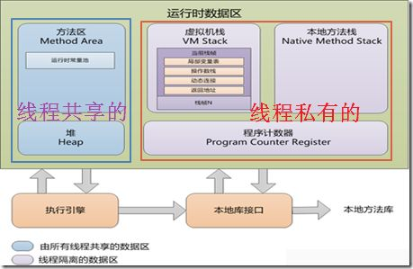

# jvm内存模型

### 名词解释

#### 线程私有的数据区:

    包括 程序计数器、 虚拟机栈 和 本地方法栈
#### 线程共享的数据区:
    
    具体包括 Java堆 和 方法区

#### 程序计数器

    在多线程情况下，当线程数超过CPU数量或CPU内核数量时，线程之间就要根据 时间片轮询抢夺CPU时间资源。也就是说，在任何一个确定的时刻，一个处理器都只会执行一条线程中的指令。因此，为了线程切换后能够恢复到正确的执行位置，每条线程都需要一个独立的程序计数器去记录其正在执行的字节码指令地址。
    
#### 虚拟机栈

    每个方法从调用直至完成的过程，对应一个栈帧在虚拟机栈中入栈到出栈的过程

#### 本地方法栈

    本地方法栈与Java虚拟机栈非常相似，也是线程私有的，区别是虚拟机栈为虚拟机执行 Java 方法服务，而本地方法栈为虚拟机执行 Native 方法服务。与虚拟机栈一样，本地方法栈区域也会抛出 StackOverflowError 和 OutOfMemoryError 异常

#### Java堆
    * Java 堆的唯一目的就是存放对象实例，几乎所有的对象实例（和数组）都在这里分配内存
    * Java堆可以处于物理上不连续的内存空间中，只要逻辑上是连续的即可。而且，Java堆在实现时，既可以是固定大小的，也可以是可拓展的，并且主流虚拟机都是按可扩展来实现的（通过`-Xmx`(最大堆容量) 和 `-Xms`(最小堆容量)控制）。如果在堆中没有内存完成实例分配，并且堆也无法再拓展时，将会抛出 OutOfMemoryError 异常。
    * TLAB (线程私有分配缓冲区) : 
        虚拟机为新生对象分配内存时，
        需要考虑修改指针 (该指针用于划分内存使用空间和空闲空间) 时的线程安全问题，
        因为存在可能出现正在给对象A分配内存，指针还未修改，
        对象B又同时使用原来的指针分配内存的情况。
        TLAB 的存在就是为了解决这个问题：每个线程在Java堆中预先分配一小块内存 TLAB，
        哪个线程需要分配内存就在自己的TLAB上进行分配，
        若TLAB用完并分配新的TLAB时，再加同步锁定，这样就大大提升了对象内存分配的效率。

#### 方法区
    * 方法区与Java堆一样，也是线程共享的并且不需要连续的内存，其用于存储已被虚拟机加载的 类信息、常量、静态变量、即时编译器编译后的代码等数据
    * 运行时常量池：是方法区的一部分，用于存放编译期生成的各种 字面量 和 符号引用. 字面量比较接近Java语言层次的常量概念，如文本字符串、被声明为final的常量值.  符号引用:包括以下三类常量：类和接口的全限定名、字段的名称和描述符 和 方法的名称和描述符.
    
    

    
    

